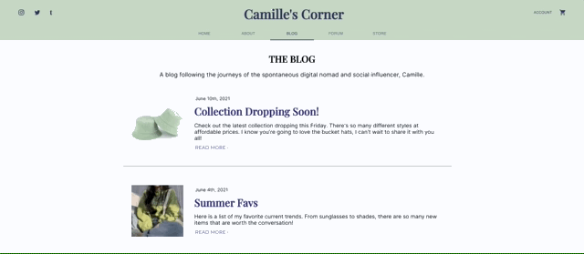
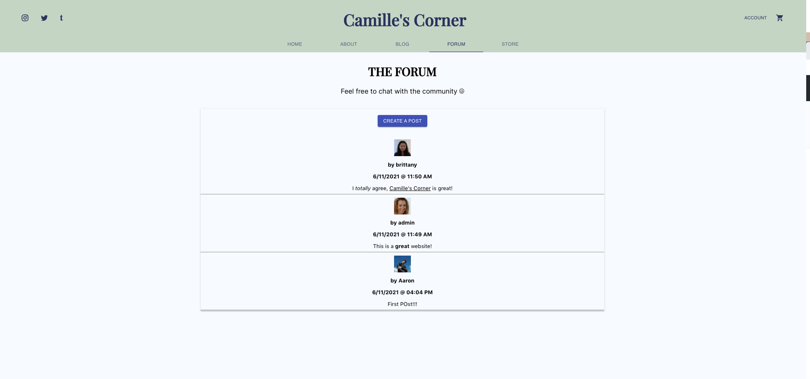
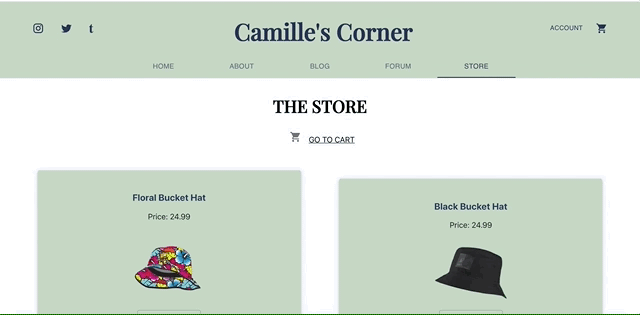

# Camille's Corner App
This app was created by a group of UVA students as a mock social media influencer platform for their friend Camille. It is a single page application built using react and react-router that combines a blog, forum, and store app all into one. 

## Pages
This site has five main pages: Home, About, Blog, Forum, and Store.

### Home

This page is the landing page for users. Here they are shown a little bit about Camille, her most recent blog post, and new arrivals in her store. This page was deisgned so the user wasn't overwhelmed when first enetering this site, and could digests the various pages and where they wanted to go. 

### About

This displays a short biography of Camille, and shows some of her social media posts.

### Blog

This page is a place for Camille to post updates about her life. This page has built in authentication, so only Camille can sign in a post updates, but other fans can sign up and leave comments on her posts!

### Forum

Here is a place for for Camille's fans to post questions and get answers from either other fans or Camille herself! This page was a later addition to the project, and could use some more styling. 

### Store

This is a place for Camille to sell her products to her fans. Since this site was an excercise, and Camille does not actually have any fans/products, there is no way to actually purchase any items. But, my team and I belive the Stripe API could be implemented very easily.

## How this was built

The Backbone of this project 

